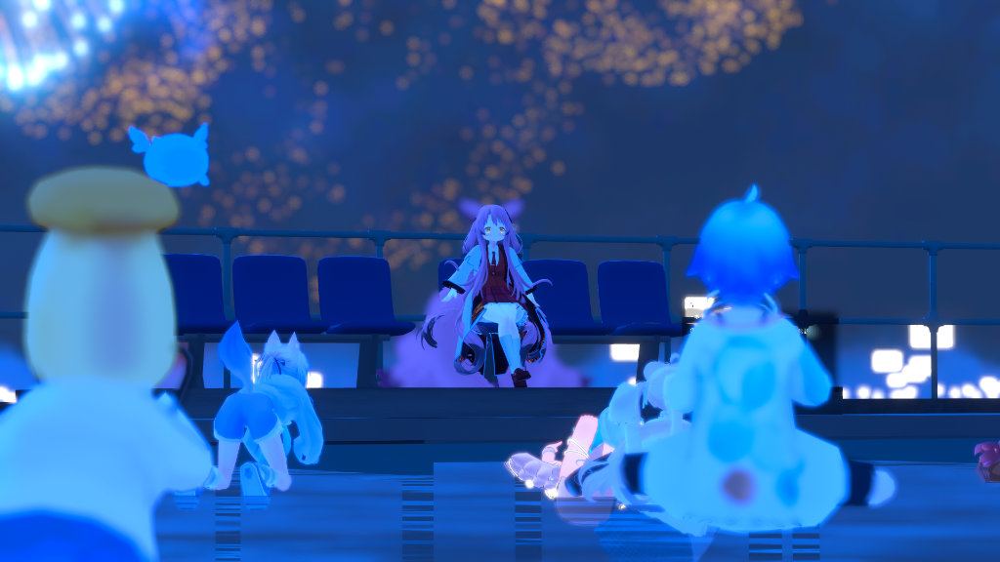

# AGENTS.md

## プロジェクト概要

このリポジトリは、VRChatワールド
「漂泊ノ海-Wandering Sea-」で開催するイベント、

**寝落ち歓迎型朗読会「漂泊ノ夢」**

の公式Webサイトです。

PCとスマートフォンの両方で閲覧できる、1ページ完結型のWebサイトとして制作します。

## サイトの主な内容

1. 朗読会の紹介
2. 次回イベントの開催情報
3. 過去イベントのアーカイブ
4. YouTube動画の表示・再生
5. キャスト紹介
6. 公式Xや各キャストの外部プロフィールへのリンク

## 技術構成

* HTML5
* CSS3
* JavaScript
* 外部フレームワークは原則使用しない
* GitHub Pagesで公開する静的Webサイト
* PC・スマートフォン両対応
* ビルド処理やサーバー処理は使用しない

## 主なファイル構成

```text
/
├─ index.html
├─ styles.css
├─ script.js
├─ AGENTS.md
└─ assets/
   ├─ photo1.jpg
   ├─ photo2.jpg
   ├─ photo3.jpg
   ├─ photo4.jpg
   ├─ photo5.jpg
   └─ キャスト画像など
```

## 各ファイルの役割

### index.html

サイト全体のHTML構造を管理します。

主なセクション：

* トップ・ヒーローエリア
* 朗読会について
* 次回の朗読会
* 過去イベントのアーカイブ
* キャスト紹介
* フッター
* YouTube動画再生用モーダル

### styles.css

サイト全体のデザインとレスポンシブ表示を管理します。

以下を含みます。

* 配色
* レイアウト
* PC・スマートフォン表示
* カードデザイン
* ヘッダー
* メニュー
* トップ画像のアニメーション
* フェード表示
* YouTubeモーダル

### script.js

動的な表示と操作を管理します。

以下を含みます。

* 過去イベント情報
* キャスト情報
* アーカイブ切り替え
* YouTubeモーダル
* スマートフォン用メニュー
* スクロール連動処理
* キャストカード生成

### assets

サイト内で使用する画像を保存します。

画像パスは原則として、以下のように記述します。

```html

```

ファイル名の大文字・小文字は厳密に区別してください。

## デザイン方針

漂泊ノ海の関連サイトとして、以下の配色を基本とします。

```css
--bg-color: #0b1325;
--text-main: #e2e8f0;
--text-sub: #94a3b8;
--accent-color: #60a5fa;
--card-bg: rgba(255, 255, 255, 0.05);
```

全体として、以下の雰囲気を維持します。

* 静かな夜
* 海
* 眠り
* 月明かり
* 落ち着いた朗読会
* 派手すぎない演出
* ゆっくりとしたアニメーション

既存の配色や世界観を、明確な理由なく変更しないでください。

## 最重要ルール：サイト内文章の取り扱い

サイト内に掲載するメッセージ、説明文、見出し、キャッチコピー、注意書きなどの文章は、ユーザーが作成・管理します。

Codexは、ユーザーから明示的な指示がない限り、サイト内の文章へ手を加えてはいけません。

以下の操作を禁止します。

* メッセージの書き換え
* 説明文の追加
* 説明文の削除
* キャッチコピーの変更
* 表現の改善
* 語尾の統一
* 誤字や表記揺れの自動修正
* 改行位置の変更
* 見出し名の変更
* 仮の文章への置き換え
* 開発者判断による文言の補足
* 既存文章を短くまとめること
* 既存文章を別の表現へ言い換えること

レイアウト変更に伴い文章部分を移動する必要がある場合も、文章の内容は一字一句変更せず、そのまま移動してください。

文章に問題があるように見える場合でも、勝手に修正せず、ユーザーへ報告してください。

ユーザーが文章変更を明示的に依頼した場合に限り、指定された範囲だけを変更してください。

人間がメンテナンスすることもあるため、実装の際は適宜コメントを挿入すること。

## 既存機能を壊さないためのルール

変更を行う前に、対象ファイルと関連処理を確認してください。

局所的な修正依頼では、依頼された箇所以外を変更しないでください。

特に以下を守ってください。

* CSS修正時にHTMLやJavaScriptを無関係に変更しない
* JavaScript修正時に既存データを削除しない
* HTML修正時に既存の文章を変更しない
* クラス名やIDを変更する場合は参照元をすべて確認する
* 動作中の機能を別方式へ勝手に置き換えない
* 大規模なリファクタリングを無断で行わない
* 使用されているか不明なコードを勝手に削除しない

修正範囲を必要最小限にしてください。

## トップ画像スライドショー

トップのヒーローエリアには、複数のイベント写真を表示します。

想定画像：

```text
assets/photo1.jpg
assets/photo2.jpg
assets/photo3.jpg
assets/photo4.jpg
assets/photo5.jpg
```

想定する演出：

1. 写真がゆっくりフェードインする
2. 表示中にゆっくり拡大する
3. 少し縮小する、または動きを緩める
4. ゆっくりフェードアウトする
5. 次の写真へ切り替わる
6. 最後の写真の後は最初へ戻る

イベント名、説明、ボタンは常に写真より手前へ表示します。

写真の上には、文字が読めるように暗い半透明レイヤーを重ねます。

スライドショーを修正する場合は、HTML、CSS、JavaScriptのどの方式で制御しているかを確認し、複数方式を混在させないでください。

CSSアニメーションで制御する場合は、JavaScriptによるクラス切り替えを併用しないでください。

JavaScriptで制御する場合は、CSS側の自動アニメーションを停止してください。

## キャスト情報

キャスト情報は `script.js` 内の配列で管理します。

各キャストは、以下の情報を持ちます。

* VRC名
* 好きな作品
* ひとこと
* プロフィール画像
* 外部リンク

外部リンクは配列で管理し、キャストごとに自由に増減できる構造とします。

例：

```javascript
{
  name: "キャスト名",
  favorite: "好きな作品",
  comment: "ひとこと",
  image: "assets/cast-example.jpg",
  links: [
    {
      label: "Xを見る",
      url: "https://x.com/example"
    },
    {
      label: "VRChat",
      url: "https://vrchat.com/home/user/usr_example"
    },
    {
      label: "YouTube",
      url: "https://www.youtube.com/@example"
    }
  ]
}
```

リンクがない場合は、空の配列とします。

```javascript
links: []
```

リンクの種類を固定せず、配列へ追加するだけでボタンが自動生成される構造を維持してください。

## アーカイブ情報

過去イベントは `script.js` 内の配列で管理します。

各イベントは、以下の情報を持ちます。

* 固有ID
* 開催日
* タイトル
* 説明
* YouTube動画ID
* サムネイル
* 朗読作品一覧

YouTube動画IDやイベント情報を追加するだけで、選択肢と表示内容へ自動的に反映される構造を維持してください。

## レスポンシブ対応

スマートフォンとPCの両方で正常に表示できるようにしてください。

最低限、以下を確認します。

* 横スクロールが発生しない
* 文字が画面外へはみ出さない
* ボタンが押しやすい
* キャストカードがスマートフォンでは縦並びになる
* メニューがスマートフォンではハンバーガーメニューになる
* YouTube動画が画面幅を超えない
* トップ画像が画面全体を自然に覆う
* イベント名が写真に埋もれない

## アクセシビリティ

以下を可能な範囲で維持してください。

* 画像へ適切な `alt` を設定する
* 装飾画像は `alt=""` とする
* キーボード操作に対応する
* ボタンとリンクを適切に使い分ける
* フォーカス表示を消さない
* `prefers-reduced-motion` を考慮する
* モーダルを閉じた際に動画再生を停止する

## 作業時の報告

変更後は、以下を簡潔に報告してください。

1. 変更したファイル
2. 変更した内容
3. 変更していない範囲
4. 確認した内容
5. 未確認事項
6. ユーザー側で必要な作業

例：

```text
変更ファイル:
- styles.css

変更内容:
- トップ画像スライドショーのアニメーション時間を修正
- 5枚の写真が順番に切り替わるよう調整

変更していない範囲:
- index.html
- script.js
- サイト内の文章
- キャスト情報
- アーカイブ情報

確認:
- CSS構文を確認
- 既存クラス名を維持

未確認:
- 実ブラウザ上での画像表示
```

## 禁止事項

ユーザーから明示的な指示がない限り、以下を禁止します。

* サイト内文章の変更
* 配色の大幅な変更
* 外部フレームワークの導入
* npmやビルドツールの導入
* ファイル構成の大幅な変更
* 既存機能の削除
* クラス名やIDの一括変更
* キャスト情報やイベント情報の削除
* 仮データへの勝手な置き換え
* 無関係なリファクタリング
* 依頼範囲外の修正
* 動作確認なしでの完了宣言

## 作業の基本方針

1. 現在のコードを読む
2. 問題の原因を特定する
3. 修正範囲を限定する
4. 必要最小限の変更を行う
5. 既存機能への影響を確認する
6. 変更内容と未確認事項を報告する

推測だけで複数箇所を変更せず、原因を確認してから修正してください。
